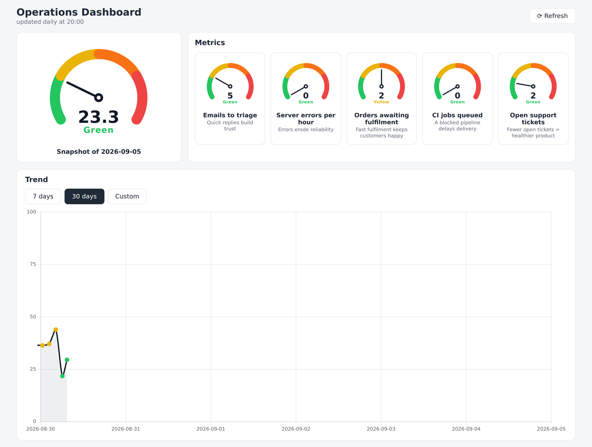

# Dashboard KPI

Generic, configurable KPI dashboard: a 0–100 aggregate index obtained from
the **weighted mean** of several metric scores, with gauges, mini-gauges and
history.

The frontend is **completely generic**: it contains no specific metric and no
company references. The whole setup (title, subtitle, metric definitions)
comes from the backend and is **managed through the API** — there are **no
business metric defaults in the code**.

## Dashboard preview



## Architecture

```
Collector ──(daily, Bearer: POST + GET)──▶ PHP API + SQLite
  gathers data                     (shared hosting, no SSH)
                                   GET  /api/config            (setup; Basic or Bearer)
                                   POST /api/config/metrics    (create/update a metric)
                                   DELETE /api/config/metrics/{key} (delete a metric)
                                   POST /api/metrics           (daily snapshot)
                                   GET  /api/metrics/*         (data; Basic or Bearer)
                                   Static dashboard (Vue)
```

- **`deploy/`** — server side, uploaded via FTP/FTPS:
  - `api/metrics.php` — the whole backend (PHP 7.4+/8.x, PDO_SQLITE, zero dependencies)
  - `api/.htaccess` — rewrites for the `/api/*` endpoints → `metrics.php`
  - `api/HELP.html` — self-contained API reference (for humans and AI agents)
  - `api/openapi.yaml` — machine-readable OpenAPI 3.0 spec of the same API
  - `data/config.php` — **deployment secrets only** (`API_TOKEN`, `DB_PATH`,
    optional Basic credentials, generic fallback title). **No metrics.**
  - `data/.htaccess` — blocks access to `data/`
  - `.htaccess` — Basic Auth for dashboard + GET API, with the Bearer token
    also allowed through for API reads/writes (validated by PHP)
- **`frontend/`** — **Vue 3 + Vite + Chart.js** app, build only locally:
  `npm install && npm run build` → upload the content of `dist/` to the
  webroot. It contains no hardcoded metric: it loads the setup from
  `GET /api/config`.
- **`.github/workflows/prod-deploy.yml`** — (optional) CI: build + FTPS deploy.

## Configuration model

Metrics are **defined through the API**, never in code:

| Table | Content | Managed by |
|---|---|---|
| `config` | single row: dashboard `title`, `subtitle` | `POST /api/config` |
| `config_metrics` | one row per metric: `key`, `name`, `why`, `G`/`Y`/`O`, `weight` | `POST /api/config/metrics`, `DELETE /api/config/metrics/{key}` |
| `metrics` | daily raw values + scores | `POST /api/metrics` |
| `snapshot` | daily aggregate index + zone | `POST /api/metrics` |

`deploy/data/config.php` holds only `API_TOKEN`, `DB_PATH`, optional Basic
credentials and a generic fallback title/subtitle (used before any
`POST /api/config`). If you edit the fallback title there, no metric appears.

## API

| Method | Path | Auth | Description |
|---|---|---|---|
| POST | `/api/config` | `Authorization: Bearer <API_TOKEN>` | Set the dashboard **title/subtitle** (metrics are NOT accepted here) |
| GET | `/api/config` | Basic Auth **or** `Authorization: Bearer` | Read the active setup: title, subtitle, all metrics |
| POST | `/api/config/metrics` | `Authorization: Bearer <API_TOKEN>` | Create or update **one metric** (upsert by key) |
| DELETE | `/api/config/metrics/{key}` | `Authorization: Bearer <API_TOKEN>` | Delete a metric |
| POST | `/api/metrics` | `Authorization: Bearer <API_TOKEN>` | Save/replace the daily snapshot (idempotent per date) |
| GET | `/api/metrics/latest` | Basic Auth **or** `Authorization: Bearer` | Latest snapshot for the gauges |
| GET | `/api/metrics?from=YYYY-MM-DD&to=YYYY-MM-DD` | Basic Auth **or** `Authorization: Bearer` | History (default last 30 days) |

The server **always recomputes** scores (0–100) and the aggregate index from
the raw values using the thresholds and weights of the **active**
configuration (the `config_metrics` rows). It never trusts the client. A
snapshot for an existing date is **replaced** (UNIQUE on `date`+`metric_key`).

Full reference with request/response examples and curl commands:
**`/api/HELP.html`** (also `deploy/api/openapi.yaml` in the repo).

### GET /api/config — example response

```json
{
  "title": "Production Dashboard",
  "subtitle": "updated daily at 20:00",
  "metrics": {
    "orders": { "name": "Orders to fulfil", "why": "fast fulfilment keeps trust", "G": 0, "Y": 2, "O": 5, "weight": 0.6 },
    "emails": { "name": "Emails to triage", "why": "quick replies improve trust", "G": 5, "Y": 15, "O": 30, "weight": 0.4 }
  }
}
```

When no metric exists yet, `metrics` is `{}`. The frontend renders the gauges
from the keys/names/descriptions of this response — no frontend change is
ever needed when metrics change.

### POST /api/config — set title/subtitle

Manages **only** the dashboard `title`/`subtitle`. Sending a `metrics` field
is rejected with `400` (metrics use the dedicated endpoints below).

```bash
curl -X POST https://example.com/dashboard/api/config \
  -H "Authorization: Bearer YOUR_TOKEN" \
  -H "Content-Type: application/json" \
  -d '{
    "title": "Production Dashboard",
    "subtitle": "updated daily at 20:00"
  }'
```

Response: `200` `{"ok": true, "title": "Production Dashboard", "subtitle": "updated daily at 20:00"}`.
Re-POSTing **replaces** title/subtitle.

### POST /api/config/metrics — create/update a metric

One metric per call (upsert by `key`). Validations: `key` URL-safe
(`[A-Za-z0-9][A-Za-z0-9_.-]*`), thresholds `G`/`Y`/`O` numeric ≥ 0, `weight`
numeric ≥ 0 (default `1`). `name`/`why` are optional.

```bash
curl -X POST https://example.com/dashboard/api/config/metrics \
  -H "Authorization: Bearer YOUR_TOKEN" \
  -H "Content-Type: application/json" \
  -d '{
    "key": "orders",
    "name": "Orders to fulfil",
    "why": "fast fulfilment keeps trust",
    "G": 0, "Y": 2, "O": 5,
    "weight": 0.6
  }'
```

Response: `200` `{"ok": true, "created": true, "key": "orders", "metric": {...}}`.
Re-POSTing the same `key` **updates** it (`created: false`).

### DELETE /api/config/metrics/{key} — delete a metric

```bash
curl -X DELETE https://example.com/dashboard/api/config/metrics/orders \
  -H "Authorization: Bearer YOUR_TOKEN"
```

Response: `200` `{"ok": true, "key": "orders", "deleted": true}` — or `404`
if the key does not exist. Historical daily rows of the deleted metric are
kept but hidden from GET responses; re-creating the same key later restores
them.

### GET /api/config — reading the configuration

```bash
curl -u user:password https://example.com/dashboard/api/config
```

Returns the **active** configuration (title/subtitle + every metric currently
in `config_metrics`).

### POST /api/metrics — daily snapshot

```bash
curl -X POST https://example.com/dashboard/api/metrics \
  -H "Authorization: Bearer YOUR_TOKEN" \
  -H "Content-Type: application/json" \
  -d '{
    "date": "2026-08-24",
    "metrics": { "orders": 2, "emails": 10 },
    "index": 0
  }'
```

The keys of the `metrics` payload must cover **all** active configuration
keys (`GET /api/config`). The `index` field is optional and **ignored**: the
server recomputes scores and the aggregate index.

## Client usage guide (collector)

The **client** (the program that gathers the data) uses the API in steps. All
examples use:

```bash
BASE=https://your-domain.com/dashboard     # or the webroot base if installed at /
TOKEN='YOUR_BEARER_TOKEN'                 # handed over by the operator (API_TOKEN in config.php)
USER='user'; PASS='password'              # optional: Basic Auth credentials (human/browser reads)
```

> **Auth**: the collector uses its Bearer token for **everything** (writes
> *and* reads). Basic credentials are only needed if you read from a browser
> or prefer Basic over Bearer on GET.

### 1) Create/update the metrics you track

Each metric is defined with `POST /api/config/metrics` (Bearer token). Repeat
for every metric; re-POSTing an existing key updates it.

```bash
curl -X POST "$BASE/api/config/metrics" \
  -H "Authorization: Bearer $TOKEN" -H "Content-Type: application/json" \
  -d '{"key":"orders","name":"Orders to fulfil","why":"fast fulfilment keeps trust","G":0,"Y":2,"O":5,"weight":0.6}'

curl -X POST "$BASE/api/config/metrics" \
  -H "Authorization: Bearer $TOKEN" -H "Content-Type: application/json" \
  -d '{"key":"emails","name":"Emails to triage","why":"quick replies improve trust","G":5,"Y":15,"O":30,"weight":0.4}'
```

### 2) Read the configuration (what to send)

`GET /api/config` returns the **active** configuration: the client reads it
to know **which keys** to use in the snapshot POST and **how** they will be
evaluated. Reads accept the **same Bearer token** used for writes (or Basic
credentials):

```bash
curl -H "Authorization: Bearer $TOKEN" "$BASE/api/config"   # collector
# or:  curl -u "$USER:$PASS" "$BASE/api/config"             # Basic
```

Meaning of each metric field:

| Field | Meaning |
|---|---|
| `key` | Unique metric id (URL-safe) |
| `name` | Label shown in the dashboard |
| `why` | Short "why it matters" shown under the name |
| `G`, `Y`, `O` | **Thresholds** of the zones: green `[0..G]`, yellow `[G+1..Y]`, orange `[Y+1..O]`, red `[O+1..∞]` |
| `weight` | **Relative weight** in the aggregate (weights are normalized; the sum does NOT need to be 1) |

### 3) Send (or update) the values of the day

`POST /api/metrics` (Bearer token) saves a daily snapshot. The payload
contains the date and **one key for each active metric** with its raw value:

```bash
curl -X POST "$BASE/api/metrics" \
  -H "Authorization: Bearer $TOKEN" -H "Content-Type: application/json" \
  -d '{
    "date": "2026-08-24",
    "metrics": { "orders": 2, "emails": 10 },
    "index": 0
  }'
```

Rules:
- `date` is the snapshot date (`YYYY-MM-DD`).
- The keys in `metrics` must cover **all** active configuration keys: a
  missing active key → `400`. Unknown extra keys are ignored.
- Values are **numeric ≥ 0**.
- The `index` field is optional and ignored: the server **recomputes**
  scores (0–100) and the aggregate index from the active configuration.
- Success response: `200` `{"ok": true, "date": "...", "index": 55.8, "zone": "orange"}`.
- If no metrics are configured yet, the API answers `400` with a hint to
  create them first via `POST /api/config/metrics`.

### 4) Update/correct the values of an already-sent day

The insert is **idempotent per date**: re-POSTing with the **same date**
**replaces** the snapshot (no duplicate, thanks to the UNIQUE constraint on
`date` + key). This is how you correct a mistake or do the evening update:

```bash
curl -X POST "$BASE/api/metrics" \
  -H "Authorization: Bearer $TOKEN" -H "Content-Type: application/json" \
  -d '{"date":"2026-08-24","metrics":{"orders":5,"emails":10},"index":0}'
```

The snapshot of the 24th becomes the new one (orders = 5), no second row is
added.

### 5) Read the data (to verify or for the collector)

The collector can use the same Bearer token to verify what was stored:

```bash
# Latest snapshot (for the gauges)
curl -H "Authorization: Bearer $TOKEN" "$BASE/api/metrics/latest"

# History — default last 30 days
curl -H "Authorization: Bearer $TOKEN" "$BASE/api/metrics"

# Custom history
curl -H "Authorization: Bearer $TOKEN" "$BASE/api/metrics?from=2026-08-01&to=2026-08-24"

# Basic credentials also work on all GETs (humans/browsers):
#   curl -u "$USER:$PASS" "$BASE/api/metrics/latest"
```

Every returned metric includes `value` (raw), `score` (0–100) and `zone`
(green/yellow/orange/red), plus the aggregate `index` and its zone. Only
metrics still present in the active configuration are returned.

### Flow summary

```
1. POST   /api/config/metrics            -> create/update each metric (Bearer)
2. GET    /api/config                    -> read the active configuration
3. POST   /api/metrics                   -> send the values of the day (Bearer)
4. POST   /api/metrics (same date)       -> update/correct the snapshot
5. GET    /api/metrics/latest and /api/metrics -> read data and verify
```

## Building the frontend

Prerequisites: **Node.js ≥ 18** and **npm** (the build is local/CI, not on
the server).

```bash
cd frontend
npm install        # or npm ci (exact reproduction from the lockfile)
npm run build      # generates frontend/dist/ (minified HTML/CSS/JS + .htaccess)
```

For development: `npm run dev` (Vite dev server with hot reload on :5173)
and `npm run preview` (serves `dist/` on :4173). Details, `dist/` structure
and troubleshooting: see **`TECH.md` §8**.

## CI / Automatic deploy (GitHub Actions)

The repository includes two workflows in `.github/workflows/`:

- **`ci.yml`** — on every push/PR it builds the frontend, verifies the
  output and uploads `dist/` as a downloadable **artifact** (no deploy).
- **`prod-deploy.yml`** — on every push to `main` (or manually) it builds
  the SPA and **publishes via FTPS** everything into a single remote folder,
  whose default is `<FTP home>/dashboard/`:
  - `index.html` + `assets/` → the **compiled frontend** (what the browser loads),
  - `api/metrics.php` + `api/.htaccess` → the **server side API**,
  - `api/HELP.html` + `api/openapi.yaml` → the API documentation,
  - `data/.htaccess` → web protection of the data folder.
  `data/config.php` is **never uploaded**: it is owned by the server and is
  left untouched so tokens/credentials are never overwritten.

To enable the deploy you need repository **secrets** and optionally a
**variable** (Settings → Secrets and variables → Actions):

| Kind | Name | Description |
|---|---|---|
| Secret | `ftp_host` | FTPS host |
| Secret | `ftp_username` | FTPS username |
| Secret | `ftp_password` | FTPS password |
| Secret | `ftp_port` *(optional)* | FTPS port (default `21`) |
| Variable | `DEPLOY_DIR` *(optional)* | target folder relative to the FTP home, must end with `/` (default `dashboard/`) |

The manual run (`workflow_dispatch`) also accepts a `deploy_dir` input that
overrides `DEPLOY_DIR`. Details: see **`TECH.md` §8.7**.

## Deploy on shared hosting (no SSH)

> Quickest path: use the **FTPS workflow** (ships `first_setup.php` +
> `data/seed.sqlite`, never uploads the server-owned files) and then run the
> one-time bootstrap. See **`QUICK_START.md`** for the full step-by-step.

1. **Build the frontend locally**: `cd frontend && npm install && npm run build`.
2. **Upload via FTP / file manager** — everything goes into a single folder
   (here `/dashboard/`; change it if you deploy with a different
   `DEPLOY_DIR`):
   - the content of `frontend/dist/` → `/dashboard/` (`index.html`,
     `assets/`); **do not** upload the root `.htaccess` from `dist/`;
   - `deploy/api/` → `/dashboard/api/` (`metrics.php`, its `.htaccess`,
     `HELP.html`, `openapi.yaml`);
   - `deploy/data/.htaccess` → `/dashboard/data/` (protects the data folder);
   - `deploy/data/kpi.sqlite` → `/dashboard/data/seed.sqlite` (seed for new
     installs);
   - `deploy/first_setup.php` → `/dashboard/` (one-time bootstrap);
   - **do not upload** `deploy/data/config.php`, `deploy/.htaccess` and
     `deploy/router.php`.
3. **Run the one-time bootstrap** (generates `data/config.php` with a real
   `API_TOKEN`, `data/.htpasswd`, the root `.htaccess` with the real
   `AuthUserFile`, and seeds `data/kpi.sqlite`):

   ```bash
   curl -X POST https://example.com/dashboard/first_setup.php \
     -H "Content-Type: application/json" \
     -d '{"user":"alice","pass":"SuperSecret123"}'
   ```

   It prints the `API_TOKEN` once — hand it to the collector. A second POST
   is refused (`409`), and later deploys never override these four
   server-owned files.
4. **Create the metrics through the API** (see "Client usage guide"), and
   optionally set title/subtitle with `POST /api/config` — the frontend
   adapts by itself. (The seed already includes sample metrics/history to get
   you started.)
5. **Smoke test**:

```bash
# Setup: read config with the Bearer token (feeder/operator)
# (on a fresh install the seed already lists 5 sample metrics)
curl -H "Authorization: Bearer YOUR_TOKEN" https://example.com/dashboard/api/config

# Read latest with the token (feeder/operator) or Basic (human)
curl -H "Authorization: Bearer YOUR_TOKEN" https://example.com/dashboard/api/metrics/latest
curl -u user:password https://example.com/dashboard/api/metrics/latest

# Update one of the seeded metrics (upsert by key; Bearer)
curl -X POST https://example.com/dashboard/api/config/metrics \
  -H "Authorization: Bearer YOUR_TOKEN" -H "Content-Type: application/json" \
  -d '{"key":"orders","name":"Orders","G":0,"Y":2,"O":5,"weight":1}'

# Test snapshot (Bearer) - must include ALL active keys (here the 5 seed keys)
curl -X POST https://example.com/dashboard/api/metrics \
  -H "Authorization: Bearer YOUR_TOKEN" -H "Content-Type: application/json" \
  -d '{"date":"2026-08-25","metrics":{"orders":1,"emails":5,"tickets":2,"errors":0,"queued":0},"index":0}'
```

**Note on Basic Auth, Bearer reads and writes**: the root `.htaccess`
protects the dashboard with Basic Auth but lets requests through when they
carry a **Bearer token** (`Require env HAS_BEARER`) or use **POST/DELETE**
(`<RequireAny>`), because the API is protected by PHP, which validates the
token (`check_read()` on GETs, `check_bearer()` on POST/DELETE). An invalid
token therefore still gets a `401` from PHP. If the host is Apache 2.2 (no
`<RequireAny>`), move the root `.htaccess` into a subfolder that contains
only the dashboard and set `BASIC_AUTH_USER`/`BASIC_AUTH_PASS` in
`config.php` (the API GETs will then be protected by PHP itself).

## Formula notes

- Score per metric: piecewise linear interpolation on bands
  `green [0,G]→[0,25]`, `yellow [G+1,Y]→[26,50]`, `orange [Y+1,O]→[51,75]`,
  `red [O+1, 2·(O+1)]→[76,100]`; saturation at `2·(O+1)` = 100.
- Aggregate index = **weighted mean**, weights are normalized:
  `index = Σ(score × weight) / Σ(weight)`; if `Σ(weight) = 0` the plain
  average of the scores is used. The weights therefore **never need to sum to
  1.00** (a default weight of `1` makes the index a simple average).
- The backend (`score_metric` in PHP) computes scores and the index; the
  frontend uses directly the values returned by the API (score and zone for
  the gauge, raw value at the center).

## Structure

```
├── .github/workflows/ci.yml
├── .github/workflows/prod-deploy.yml
├── README.md
├── TECH.md
├── deploy/
│   ├── .htaccess
│   ├── api/{.htaccess, metrics.php, HELP.html, openapi.yaml}
│   └── data/{.htaccess, config.php}
└── frontend/
    ├── package.json
    ├── vite.config.js
    ├── index.html
    ├── public/.htaccess
    └── src/{main.js, App.vue, api.js, metrics.js, style.css, components/…}
```
